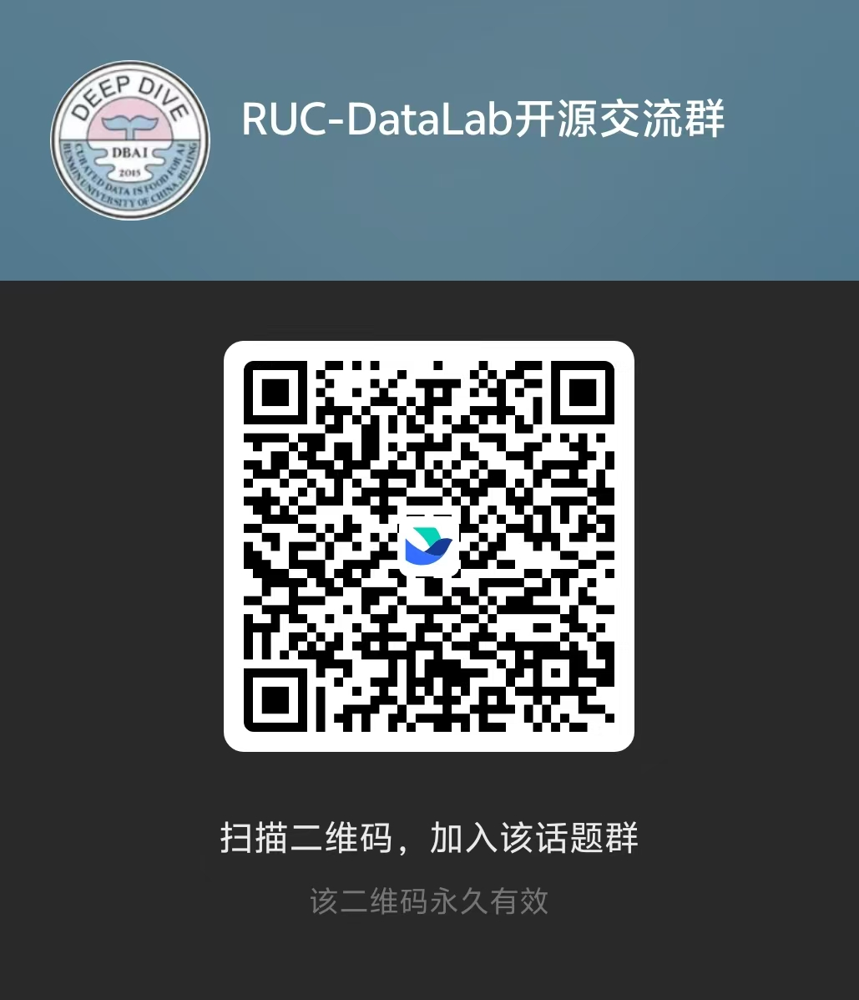

### Hi there

Welcome to **RUC-DataLab**, the Data Intelligence Lab at Renmin University of China.

We explore data-centric AI, autonomous data science, and intelligent data management.

&nbsp;
&nbsp;
&nbsp;

  

### Featured Projects

- [DeepAnalyze](https://github.com/ruc-datalab/DeepAnalyze): Agentic large language models for autonomous data science.
- [EvoOntology](https://github.com/ruc-datalab/EvoOntology): A self-evolving ontology layer for data agents.
- [SkillAdam](https://github.com/ruc-datalab/SkillAdam): Better skills for your AI agent through evaluation-driven improvement.
